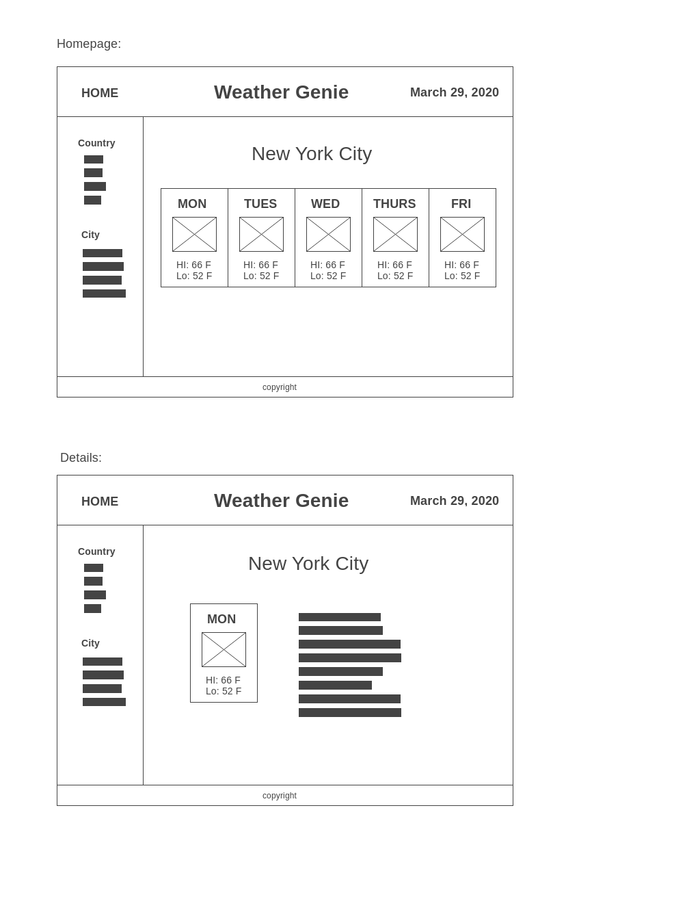

# p2_open_weather
Project 2: Getting 5 days weather data

---------------------
HTML
---------------------
http://

---------------------
 Title:
---------------------
  Weather Genie

---------------------
  Description:
---------------------
1. Displays the 5 days weather data with the high, low temperature and icon image for the selected city and country.
2. User has option to click to get the details of each day.
3. User has option to choose the city to get the weather for.
4. The buttons and cloud icon will be created in the storybook.
5. The header will contain the homepage links
6. The sidebar will be included to list the cities options to retrieve weather data.

---------------------
Wireframes
---------------------

---------------------
  API: OpenWeather
---------------------
https://openweathermap.org/api

---------------------
  MVP Features
---------------------
1. README file.

2. Building the APP in REACT which includes axios API call, React DOM manipulation and class react components using link and route.

3. Mapping the city weather using provided city Id json file to call the weather API.

4. City Id data and API returned data will be stored in class state 

5. Six or more rendered components 
  - Header 
  - country list
  - city list based on selected country
  - 5 days data
  - city name title
  - detail weather data
  - footer

6. Storybook - 5 or more components.

7. Styling:  using the flex for header links and grid for the main styling.

8. Implement responsive design for desktop, ipad and iphone X

9. Final project will be deployed to Surge or Netlify.

---------------------
  POST MVP:
---------------------
POST MVP: If time allows, I like to do the following:

1. CSS styling to make the webpage with more professional appearance.
2. Add counter to track the number of website visiters.

---------------------
SWOT Analysis
---------------------
After connecting the API and retrieving the data, I am comfortable that this is a stable API and able to use the data. I amy encounter issues doing the following:

 - Creating the storybook component and using it in the react app. If running into issue, I will try to use google and online videos.

 - I will take this opportunity to get more familiar with grid styling for the detail page with the sidebar layout.

 - If time allows, I will try to build the hamburger menu tab which I will try to figure it out.

